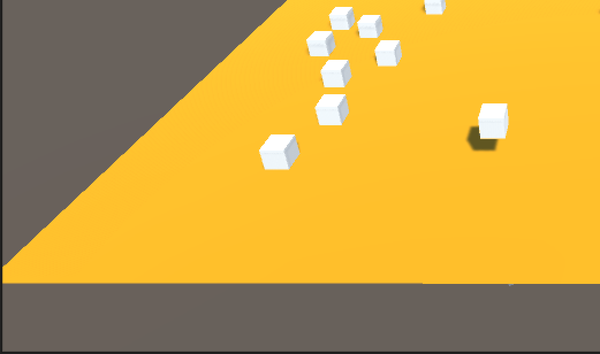

# GodlikeProject: Ryan Yip

An interactive environment that can receive inputs from the mouse and keyboard to perform certain actions. The primary goal of the project was to create an interactive environment where the user can manipulate certain objects using key and mouse inputs.
Cubes randomly spawn on a platform. The left click fires a cannonball where the user clicks. The WASD keys are used to move cannonballs in directions corresponding to the directional keys. The space bar causes all the cubes to jump. The T key removes all objects from the environment.

